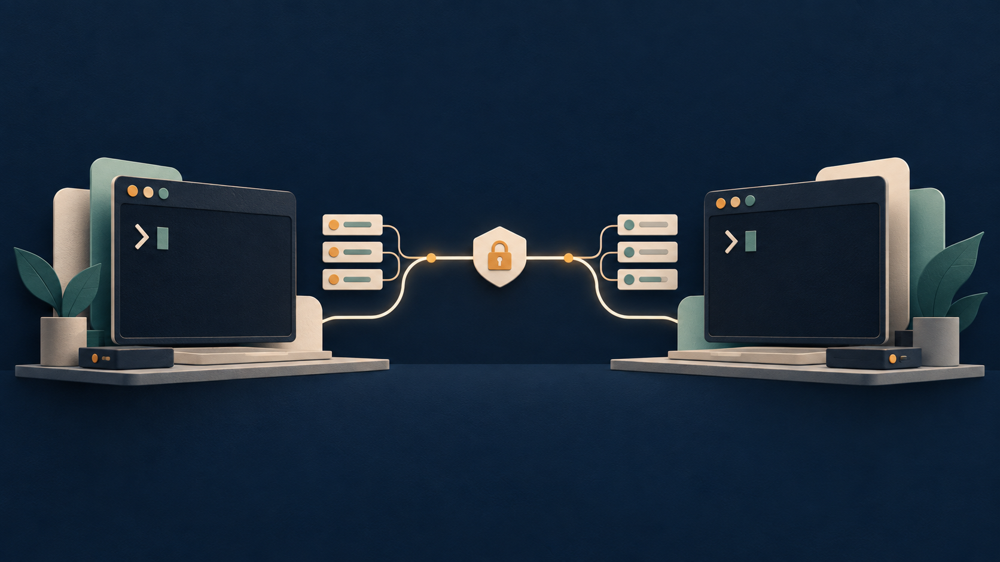
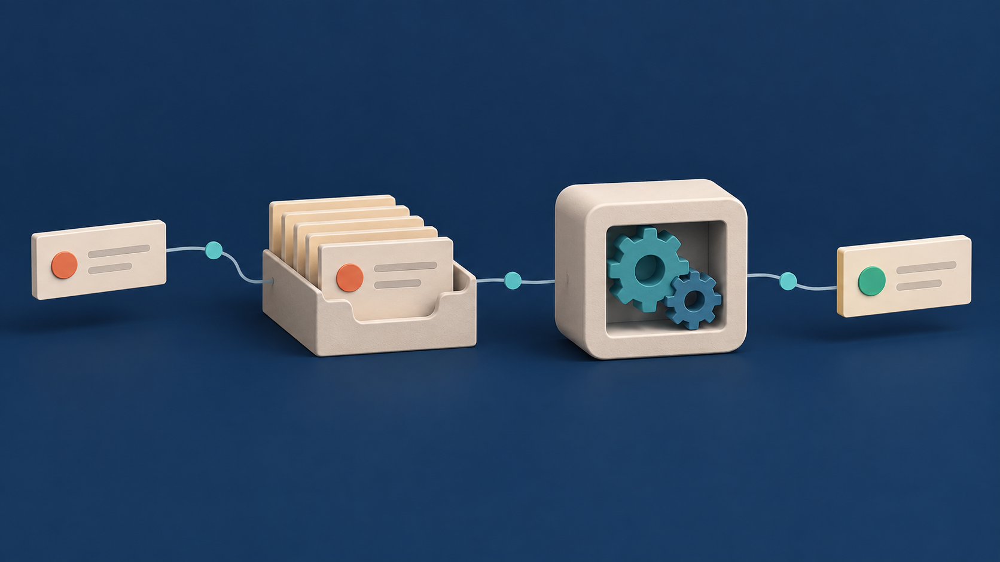

# Agents Bridge

[](https://www.npmjs.com/package/agents-bridge-mcp)
[](https://www.npmjs.com/package/agents-bridge-mcp)
[](./LICENSE)
[](https://nodejs.org)

[Português (Brasil)](./docs/README.pt-BR.md)

Let [Claude Code](https://code.claude.com/) and the [Codex CLI](https://developers.openai.com/codex/cli/) ask, review, research, plan, implement and lead each other as background jobs.



## Why Agents Bridge

- **A second opinion from a different model.** Ask the other CLI a question, or have it review your diff, before you commit to an approach. It reads your repository; it does not share your session's assumptions.
- **Work that does not block you.** Every task is a durable background job with an id. The session that started it can end, and the result is still there.
- **Roles instead of raw prompts.** `ask`, `review`, `research`, `plan`, `implement` and `teamlead` each send a tuned prompt with a defined output format, and each runs with the narrowest permissions that role needs. Jobs are read-only unless you say otherwise.

## 60-second quickstart

Install the plugin in the host you use (or both), then restart the host.

```bash
# Claude Code
claude plugin marketplace add naldomadeira/agents-bridge-mcp
claude plugin install agents-bridge@agents-bridge

# Codex
codex plugin marketplace add naldomadeira/agents-bridge-mcp
codex plugin add agents-bridge@agents-bridge
```

Ask the other model something. In Claude Code, plugin skills are namespaced; in Codex you mention the skill with `$` or pick it from the skills menu:

```text
/agents-bridge:ask codex Is it safe to call this migration twice? See db/migrate/0042.sql
$ask claude Does this retry loop in src/queue.ts have a race?
```

Check the installation:

```bash
npx -y agents-bridge-mcp doctor
```

`doctor` verifies Node.js, the `codex` and `claude` CLIs on your `PATH`, the job state directory, stuck jobs and legacy registrations, and prints a fix for each problem. See the [installation guide](./docs/INSTALL_FOR_AGENTS.md) for upgrades, a local-development install and migration from legacy `setup` installs.

## What you can do

Six roles, each reachable as a skill, an MCP tool and a CLI command. `<provider>` is `codex` or `claude`; pick the one that is not the host you are in.

| Role        | Skill       | MCP tool           | CLI                                                              | Mode                               |
| ----------- | ----------- | ------------------ | ---------------------------------------------------------------- | ---------------------------------- |
| `ask`       | `ask`       | `bridge_ask`       | `jobs ask <provider> "<question>"`                               | read-only                          |
| `review`    | `review`    | `bridge_review`    | `jobs start <provider> "<prompt>" --role review`                 | read-only                          |
| `research`  | `research`  | `bridge_research`  | `jobs start <provider> "<prompt>" --role research`               | read-only (Claude adds web access) |
| `plan`      | `plan`      | `bridge_plan`      | `jobs start <provider> "<prompt>" --role plan`                   | read-only                          |
| `implement` | `implement` | `bridge_implement` | `jobs start <provider> "<prompt>" --role implement --mode write` | write                              |
| `teamlead`  | `teamlead`  | `bridge_teamlead`  | `jobs start <provider> "<prompt>" --role teamlead`               | read-only by default, write opt-in |

`bridge_ask` waits for the answer (up to 120 seconds by default) and returns it in the same call. The other role tools return a job id immediately unless you pass `waitSeconds`.

Four more skills cover the rest:

- `jobs` lists, observes, collects and cancels jobs.
- `delegate` is the generic path (`bridge_start`) for work that fits no role.
- `codex` and `claude` are shortcuts that route a plain request to the right role with the provider already set.

In Claude Code the plugin also adds four agents that wrap Codex: `codex-teammate` (questions and general delegation), `codex-reviewer`, `codex-researcher` and `codex-teamlead`. They brief Codex, verify what it returns and report their own conclusion instead of forwarding raw output.

Every command in the table works without MCP. Prefix CLI commands with `npx -y agents-bridge-mcp`.

## Team lead mode

A team lead is a job whose worker plans a broad objective, delegates pieces to the other provider through the CLI, reviews the results and writes a report. You start it with `bridge_teamlead` or the `teamlead` skill and follow it with `bridge_observe`.

```text
your session (depth 0)
  `-- teamlead job (codex)             depth 1, sandbox: danger-full-access
        |-- research job (claude)      depth 2, read-only, cannot delegate
        |-- review job (claude)        depth 2, read-only, cannot delegate
        `-- implement job (claude)     depth 2, write, one per working tree
```

The final report has the sections Objective, Plan, Delegations (id, provider, role, status), Findings, Decisions, Deliverables and Open questions. `jobs observe <id>` shows the lead's output with its children; `jobs list --parent <id>` lists only the children.

> **Codex sandbox warning.** A Codex team lead runs with `--sandbox danger-full-access`. It has to start worker processes and write job state under `~/.agents-bridge`, which the `workspace-write` sandbox does not allow. Treat a Codex team lead like any Codex session with full filesystem access, or lead with `claude` instead, whose permissions are an explicit tool allowlist.

Use a team lead only when the work has several independent parts. One question or one review is cheaper as `ask` or `review`.

## How it works

Agents Bridge treats delegated work as a durable background job:

1. Start a task on `codex` or `claude`. The tool returns a job id immediately (or the answer, for `bridge_ask`).
2. Wait for that id, collect its result, or request progress when a person asks for it.
3. Use the stored result to decide the next step. Jobs survive the caller session ending.



The jobs MCP server (`npx -y agents-bridge-mcp serve jobs`, registered by the plugin) and the `jobs` CLI share one runtime. State lives under `~/.agents-bridge`. A detached worker runs the provider CLI and records the output, so an expired wait never stops a job.

| Capability           | MCP                                                                                                                    | CLI                                  |
| -------------------- | ---------------------------------------------------------------------------------------------------------------------- | ------------------------------------ |
| Start work           | `bridge_start`, `bridge_ask`, `bridge_review`, `bridge_research`, `bridge_plan`, `bridge_implement`, `bridge_teamlead` | `jobs start`, `jobs ask`             |
| Wait or fetch output | `bridge_wait`, `bridge_result`                                                                                         | `jobs wait <id>`, `jobs result <id>` |
| Request progress     | `bridge_observe`                                                                                                       | `jobs observe <id>`                  |
| Cancel work          | `bridge_cancel`                                                                                                        | `jobs cancel <id>`                   |
| Find jobs            | `bridge_list`                                                                                                          | `jobs list [--cwd] [--parent <id>]`  |

Skills prefer the `bridge_*` tools. If the host did not load MCP, they run the same job contract through `npx -y agents-bridge-mcp`; they never change a user's host configuration as a fallback.

## Usage examples

### Ask a quick question

```bash
npx -y agents-bridge-mcp jobs ask codex "Why might src/jobs/store.ts lose a write under concurrent workers?" --wait 120s
```

The answer is printed when it arrives. If the wait expires, the job keeps running: `jobs wait <id>` collects it.

### Review a change

Start with a read-only request. Give the receiving CLI enough context to produce an actionable result: name the goal, relevant files or diff, and the expected answer.

```bash
npx -y agents-bridge-mcp jobs start codex "Review the current diff. Report only actionable findings." --role review
# retain the job ID printed by start
npx -y agents-bridge-mcp jobs wait <job-id>
```

After a plugin restart, the same workflow can be requested through the installed `review` skill or the `delegate` skill. The skill selects MCP when it is available and otherwise runs the CLI commands above.

### Delegate an authorized edit

Jobs default to `read-only`. Use `write` only when the task is explicitly allowed to change files, and send one write job per working tree at a time.

```bash
npx -y agents-bridge-mcp jobs start claude "Add a focused regression test for the parser." --role implement --mode write --cwd .
npx -y agents-bridge-mcp jobs wait <job-id>
```

### Run a team lead

```bash
npx -y agents-bridge-mcp jobs start claude "Audit the CLI for inconsistent error handling and propose fixes. Delegate independent areas to codex." --role teamlead
npx -y agents-bridge-mcp jobs observe <job-id>
npx -y agents-bridge-mcp jobs wait <job-id> --timeout 10m
```

### Continue, inspect, or cancel a job

An expired wait does not stop work. Repeat `wait` for the same ID, inspect output when progress is requested, or collect a stored result after an interrupted terminal session.

```bash
npx -y agents-bridge-mcp jobs observe <job-id>
npx -y agents-bridge-mcp jobs result <job-id>
npx -y agents-bridge-mcp jobs cancel <job-id>
```

A finished job with a saved session can continue on the same provider:

```bash
npx -y agents-bridge-mcp jobs start codex "Address the highest-priority finding." --continue <job-id>
```

| `wait` exit code | Meaning                               | Next action                                      |
| ---------------- | ------------------------------------- | ------------------------------------------------ |
| `0`              | Job completed                         | Read and assess the returned result.             |
| `1`              | Job failed or was canceled            | Read `result` for the retained output and error. |
| `2`              | Wait expired while job remains active | Repeat `wait`; do not create a duplicate job.    |

`jobs ask` uses the same exit codes. Do not pipe `wait` or `ask`: a pipe discards the exit code.

## Safety model

- **Read-only by default.** Every role except `implement` runs read-only. `implement` is write mode, and `teamlead` can be write only if you pass `mode: write`.
- **Permissions per role.** The sandbox or tool allowlist follows the role:

  | Role and mode                       | Codex sandbox        | Claude permissions                                                                      |
  | ----------------------------------- | -------------------- | --------------------------------------------------------------------------------------- |
  | read-only (`ask`, `review`, `plan`) | `read-only`          | allowlist: `Read`, `Grep`, `Glob`, and `git diff`, `git log`, `git show`, `git status`  |
  | `research`                          | `read-only`          | the read-only allowlist plus `WebSearch` and `WebFetch`                                 |
  | `implement` (write)                 | `workspace-write`    | `acceptEdits` permission mode                                                           |
  | `teamlead`                          | `danger-full-access` | the read-only allowlist plus the `agents-bridge-mcp` CLI (and `acceptEdits` when write) |

- **Delegation depth limit of 2.** A session starts a team lead, the team lead delegates to workers, and those workers cannot delegate. Only a top-level session can start a team lead; the runtime refuses the rest.
- **One `write` job per working tree at a time.** Two writers in one tree collide. The skills and the team lead prompt follow this rule; use separate git worktrees for parallel edits.
- **The delegator owns acceptance.** Job output is an input to your judgment. Verify claims and run the tests before you merge anything a worker produced.
- **No hidden configuration changes.** The plugin registers its own MCP server. The fallback path runs the CLI and never edits host configuration. Do not put secrets in briefings: prompts and results are stored in plain text under `~/.agents-bridge`.

## Troubleshooting

Start with `npx -y agents-bridge-mcp doctor`. It prints `ok`, `warn` or `fail` for each check with a hint, and exits `1` if any check fails. It runs without `codex` or `claude` installed and reports the missing CLI as a warning.

| Symptom                                             | Likely cause and fix                                                                                     |
| --------------------------------------------------- | -------------------------------------------------------------------------------------------------------- |
| `bridge_*` tools or skills do not appear            | Restart the host after installing; check `claude plugin list` or `codex plugin list`.                    |
| A job fails immediately                             | The destination CLI is missing from `PATH` or not authenticated. `doctor` reports both.                  |
| `wait` or `ask` exits `2`                           | The job is still running. Repeat `jobs wait <id>`; do not start a duplicate.                             |
| A job shows `running` but nothing happens           | The worker process died. `doctor` lists these jobs; `jobs cancel <id>` clears them.                      |
| `Delegation depth limit reached`                    | A delegated worker tried to delegate. Return the findings to the session that started the job instead.   |
| `Only a top-level session can start a teamlead job` | A worker tried to start a team lead. Start it from your own session.                                     |
| Duplicated or conflicting tools                     | A legacy `setup` install is still registered. `doctor` flags it; see the migration section of the guide. |

## Requirements

- Node.js 18 or later
- Claude Code and/or Codex CLI, authenticated
- The destination CLI available on the initiating host's `PATH`

## Legacy setup

`npx -y agents-bridge-mcp setup` remains available for existing installations that use the synchronous bridge servers or the legacy `/codex` and `/claude` shortcuts. New installations should use the plugin. The [installation guide](./docs/INSTALL_FOR_AGENTS.md#move-from-a-legacy-setup-install) explains how to remove only the legacy entries that belong to Agents Bridge.

## Development

```bash
git clone https://github.com/naldomadeira/agents-bridge-mcp.git
cd agents-bridge-mcp
pnpm install
pnpm build
pnpm test
pnpm lint
```

Release notes are in the [changelog](./CHANGELOG.md).

## License

[MIT](./LICENSE)
